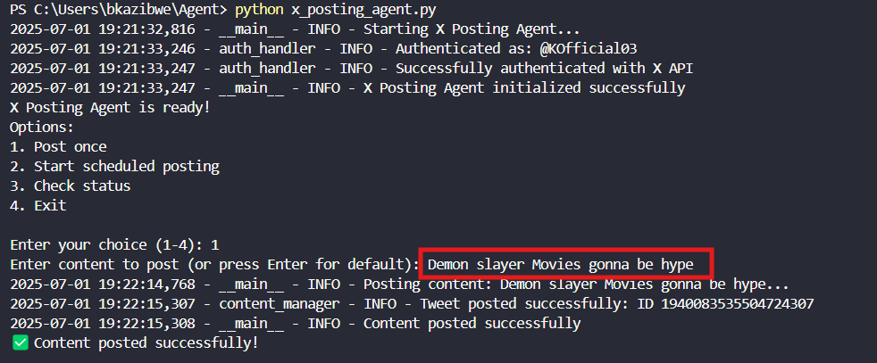

# X Posting Agent

X posting agent By **Bantrobusa kazibwe FZ  2300707416 23/U/07416/EVE** ...Decided to go all out on this project because I want to explore automating my tiktok posts,X and others.
For the safety of my X account i will not share my secret keys so you will have to generate your own to use but i detailed the instructructions on how .
**Live demonstration**



## 🚀 Features

- **Automated Content Posting**: Post tweets programmatically with retry logic
- **Secure Authentication**: OAuth 1.0a implementation with environment variable protection
- **Rate Limit Management**: Built-in rate limiting to respect X API constraints
- **Scheduled Posting**: Support for automated posting at specified intervals
- **Media Upload Support**: Ability to post images and videos alongside text
- **Comprehensive Logging**: Detailed logging for monitoring and debugging
- **Interactive Interface**: Menu-driven interface for easy operation
- **Error Handling**: Robust error handling with automatic retry mechanisms

## 📁 Project Structure

```
├── x_posting_agent.py      # Main application entry point
├── auth_handler.py         # X API authentication management
├── content_manager.py      # Content posting and rate limiting logic
├── config.py              # Configuration settings and validation
├── utils.py               # Utility functions and helpers
├── test_auth.py           # Authentication testing script
├── test_posting.py        # Posting functionality testing script
├── check_permissions.py   # Permission verification utility
├── requirements.txt       # Python dependencies
├── .env                   # Environment variables (API keys)
├── .env.example          # Template for environment variables
├── .gitignore            # Git ignore patterns
├── copilot-instructions.md # Development guidelines
└── README.md             # This file
```

## 📋 File Descriptions

### Core Application Files

**`x_posting_agent.py`** - Main Application
- Entry point for the X Posting Agent
- Provides interactive menu interface
- Handles application initialization and coordination
- Manages scheduled posting functionality
- Contains the main event loop and user interaction logic

**`auth_handler.py`** - Authentication Handler
- Manages X API authentication using OAuth 1.0a
- Handles both API v1.1 and v2 client initialization
- Performs authentication testing and validation
- Provides secure access to authenticated API clients
- Includes error handling for authentication failures

**`content_manager.py`** - Content Management
- Core posting functionality with retry logic
- Rate limiting implementation to respect API constraints
- Media upload handling for images and videos
- Content validation and formatting
- Posting status tracking and monitoring

**`config.py`** - Configuration Management
- Centralized configuration settings
- Environment variable loading and validation
- API rate limit configuration
- Logging configuration settings
- Content sources and default content management

**`utils.py`** - Utility Functions
- Helper functions for content validation
- File handling utilities
- Timestamp formatting functions
- JSON configuration management
- Media file type detection
- Content truncation and sanitization

### Testing and Verification Files

**`test_auth.py`** - Authentication Testing
- Quick authentication verification script
- Tests API credential validity
- Verifies connection to X API
- Useful for debugging authentication issues

**`test_posting.py`** - Posting Testing
- Tests posting functionality with current permissions
- Verifies tweet creation capabilities
- Helps diagnose permission-related issues
- Safe testing environment for new features

**`check_permissions.py`** - Permission Checker
- Analyzes current app permissions
- Provides guidance for permission configuration
- Helps troubleshoot 403 Forbidden errors
- Generates setup instructions for X Developer Portal

### Configuration Files

**`requirements.txt`** - Dependencies
- Lists all required Python packages
- Specifies version constraints for stability
- Includes core dependencies: tweepy, python-dotenv, requests, schedule

**`.env`** - Environment Variables
- Contains sensitive API credentials
- Not tracked in version control for security
- Loaded automatically by the application
- Required for authentication with X API


## 🛠️ Setup Instructions

### 1. Prerequisites
- Python 3.8 or higher
- X Developer Account with API access
- Git (optional, for version control)

### 2. Installation

Clone or download this repository:
```bash
git clone <your-repo-url>
cd x-posting-agent
```

Install dependencies:
```bash
pip install -r requirements.txt
```

### 3. X API Configuration

1. **Create X Developer Account**
   - Visit [X Developer Portal](https://developer.twitter.com/en/portal/dashboard)
   - Create a new application

2. **Configure App Permissions**
   - Set app permissions to "Read and Write"
   - Choose "Web App, Automated App or Bot" as app type
   - Fill in required callback URLs and website information

3. **Generate API Keys**
   - Copy your API Key and API Secret
   - Generate Access Token and Access Token Secret
   - Copy your Bearer Token

4. **Environment Setup**
   ```bash
   cp .env.example .env
   ```
   
   Edit `.env` with your actual credentials:
   ```bash
   X_API_KEY=your_api_key_here
   X_API_SECRET=your_api_secret_here
   X_ACCESS_TOKEN=your_access_token_here
   X_ACCESS_TOKEN_SECRET=your_access_token_secret_here
   X_BEARER_TOKEN=your_bearer_token_here
   ```

### 4. Testing Setup

Test authentication:
```bash
python test_auth.py
```

Test posting permissions:
```bash
python test_posting.py
```

## 🎯 Usage

### Interactive Mode
Run the main application:
```bash
python x_posting_agent.py
```

Choose from menu options:
1. **Post once** - Send a single tweet
2. **Start scheduled posting** - Begin automated posting
3. **Check status** - View system status and rate limits
4. **Exit** - Stop the application

### Programmatic Usage

```python
from content_manager import ContentManager

# Initialize content manager
cm = ContentManager()

# Post a tweet
success = cm.post_tweet("Hello from my X posting agent! 🤖")

# Post with media
media_id = cm.upload_media("image.jpg")
success = cm.post_tweet("Check out this image!", [media_id])

# Get rate limit status
status = cm.get_rate_limit_status()
print(status)
```

## ⚙️ Configuration

### Posting Configuration
Edit `config.py` to customize:
- Tweet character limits
- Retry attempts and delays
- Rate limiting windows
- Default content and hashtags

### Scheduling
Modify the scheduling in `x_posting_agent.py`:
```python
# Post every hour
schedule.every(1).hours.do(self.post_content)

# Post daily at specific time
schedule.every().day.at("09:00").do(self.post_content, "Good morning!")

# Post on specific days
schedule.every().monday.at("10:00").do(self.post_content)
```

### Logging
Adjust logging levels in `config.py`:
```python
LOGGING_CONFIG = {
    'level': 'INFO',  # DEBUG, INFO, WARNING, ERROR
    'filename': 'x_posting_agent.log',
    'max_bytes': 10485760,  # 10MB
    'backup_count': 5
}
```

## 🔒 Security Best Practices

- **Never commit API keys** to version control.Thats why i didnt commit mine
- **Use environment variables** for all sensitive data
- **Regularly rotate API keys** for security
- **Monitor API usage** in X Developer Portal
- **Keep dependencies updated** to patch security vulnerabilities

## 📊 API Limits

The X API has the following rate limits:
- **Tweet creation**: 300 tweets per 15-minute window
- **Media upload**: 50 uploads per 15-minute window
- **User lookup**: 900 requests per 15-minute window

The agent automatically handles these limits with built-in rate limiting and retry logic.

## 🐛 Troubleshooting

### Common Issues

**403 Forbidden Error**
- Ensure app permissions are set to "Read and Write"
- Regenerate access tokens after changing permissions
- Verify all API credentials are correct

**Authentication Failed**
- Check API keys in `.env` file
- Verify Bearer Token is correctly formatted
- Ensure no extra spaces in credentials

**Rate Limit Exceeded**
- The agent handles this automatically
- Check logs for retry information
- Consider reducing posting frequency

### Debug Mode
Enable debug logging by setting:
```bash
LOG_LEVEL=DEBUG
```

Check logs at `x_posting_agent.log` for detailed information.

## 🤝 Contributing

This is a personal project, but feel free to fork and modify for your own use because im a generous person 😂😂. If you find bugs or have suggestions:

1. Check existing issues
2. Create detailed bug reports
3. Test thoroughly before submitting changes

## 📄 License

This project is for personal use. Please respect X's Terms of Service and API usage guidelines.

## 🔗 Links

- [X Developer Portal](https://developer.twitter.com/en/portal/dashboard)
- [X API Documentation](https://developer.twitter.com/en/docs/twitter-api)
- [Tweepy Documentation](https://docs.tweepy.org/)

---

